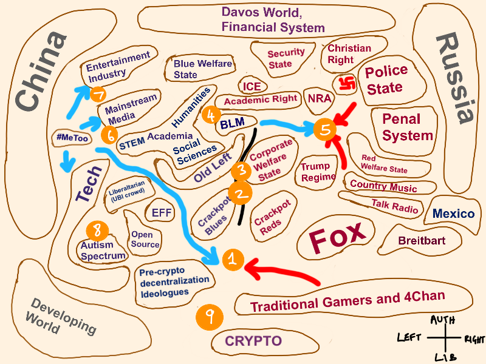

# War Mind, and the Online Brain

Mar. 24 2021

I’d like to record some of my impressions after reading [this blog post](https://www.ribbonfarm.com/2018/03/06/a-quick-battle-field-guide-to-the-new-culture-wars/) by Venkatesh Rao.  It will be my goal to focus on the parts I see as indicative of a broader idea in peoples heads and not to critique the writer himself.  I am totally unfamiliar with his work.  The possibility certainly exists that he is a very insightful writer in many other areas.  However, I must admit at the outset that I found the piece both indicative of a troubling pathology and also kind of ridiculous.  I would like to emphasize that my thoughts on this are limited to ideas expressed by Mr. Rao in his post, and will generalize to a broader social context but not a broader critique of him, his work, or enter into speculation about his own personal motivations in writing this piece. 

To summarize briefly, Rao argues in his post that the culture war raging in the online spaces that he frequents is best understood as an actual war, and not dismissed as the obnoxious passtime of an underproductive professional class living off the surplus labor of workers further down the food chain.  There are a lot of extended definitions and descriptions of various “battlefronts” and a four quadrant ideological spectrum onto which he’s placed various words and phrases.  He claims it’s an attempt to create a battlefield map he hopes will help readers avoid getting PTSD.  His own quixotic and bizarre delineations of this conflict aside, the main point he seems to be making is that online arguments are serious like wars, and that people should treat them that way.  

The first thing that jumps out to me is Rao’s repeated assertions that American society entered a state of war in 2014.  His main subject in this post is the culture war which anyone paying attention understands as a phenomenon that extends much further back than 6 years with periods of much more frequent literal violence emanating from its core social conflicts.  The dating of a state of war in 2014 seems to be entirely autobiographical for Rao.  This is true of the treatment of almost everything in the post, in my estimation.  Maybe it’s with keeping to his blog’s tagline of “constructions in magical thinking” which in the about section of the blog, we’re instructed to think of as “disciplined solipsism and escapism”.  The general feeling does seems to be that nothing existed or has been thought of before it entered Rao’s own consciousness.  

Perhaps, this explains why he seems unaware that the United States as a society has been at war, uninterrupted, for the past 20 years.  Indeed, the US has literally been at war, engaged in multiple real hot wars in several countries involving millions of Americans and in the lower bound several hundred thousand deaths. The fact that this goes completely unmentioned seems like a bit of an oversight.  I emphasize literally, because Rao also claims that the culture war he is theorizing is not a metaphorical or allegorical one, but a real war.  Despite, he admits, the lack of physical violence or deaths, small arms combat, bombing campaigns or exchanges of artillery barrages generally considered to characterize real wars.  Perhaps when Rao says “literally”, he means it in the more common-usage sense, aka “figuratively”.

I think he emphasizes this point because it seems to be his only even mild departure from conventional thinking around the culture war.  Apart from a lot of jargon it’s hard to see what his contribution is to any kind of discourse around culture war, or even what his motivation might be in writing about it.  The conventionality of his thought surrounding the subject is what I found interesting, though.

What I found most revealing about his attempt at theorizing cultural friction as literal war was how all encompassing his idea seemed to be.  Every part of American society according to Rao’s ideas is part of the culture war.  In his telling, it even extends beyond America.  He begins his discourse by graphing a seemingly random set of buzzwords, concepts and institutions asserted to be engaged in the culture war on what he describes as “the popular politics 2×2 meme”.  In a strange and wholly unexplained decision he has drawn the largest blobs on his map to be China, and Russia as opposite poles of left and right authoritarianism, respectively.  This bizarre incorporation is only confused more when he includes a very small blob on the furthest right portion of the map that contains the word “Mexico”.  
  
---

---

The meaning of all this is mysterious.  He shares his intentions with the rest of the graph only partially by numbering various points and then listing what conflicts, or “battlefronts” they represent.  For instance, number 2 represents “Climate politics” and Rao assures the reader that:

“If I were to draw a more metaphorically rich map, this would be an oceanic battlespace, like the U-boats vs Allied shipping battle in the North Atlantic in World War 2.”

It’s not clear what exactly this is supposed to mean.  Telling the reader that what you assert is a real actual war and not a metaphorical one is best represented metaphorically by a real war is confusing.

His selection of which “battlefronts” to describe is a haphazard smattering of political topics, broadly construed, and what I can only guess are more personal interests like the classic culture war conflict between “Hyperneurotypicals versus non-neurotypicals” (number 8 on the graph).  Maybe you’re aware of it and know what it means, maybe you’re not, but Rao thinks that this conflict in our society “might easily turn out to be among the most consequential in the long term.”  Again, maybe it’s just part of the brand to grab whatever happens to come to mind and then assert that it has historical and profound importance, but it doesn’t help the reader orient themselves on the map very well.  This is important because the confusion undercuts Rao’s purpose in creating the map which he hopes will help online travelers and likeminded “combatants” avoid “crippling PTSD” from losing too many arguments on Twitter.  There’s only so much being owned, and getting dunked on that a person’s psyche is capable of withstanding. 

I don’t want crippling PTSD and I don’t want Rao to have it either, so I’ll try to turn my focus toward what is worth saying about his post.  I think it’s indicative of a particular derangement of our time that among a certain class the entire sphere of public life can only be understood in the frame of culture war.  Many may experience it less explicitly than Rao, but increasingly it seems a subset of extremely online professionals are retreating into a fantasy of binary warfare.  One which places them heroically on a battlefield across from the forces of a nefarious enemy bent on dominating everything.  In response, the only impulse one is allowed to express is one of zealous devotion to total annihilation of the other.  

Regardless of the reality, this fantasy serves a powerful purpose.  It not only enriches the owners of the social media platforms on which these theatrical “battlespaces” coalesce, but establishes the ecosystem on which media influencers and commentators depend for incomes and status.  In addition, it has become an increasingly powerful tool of conformity and institutional discipline.  As one NYTimes staffer wrote in a leaked slack conversation, “this is a barricades moment, which side are you on?”

An atmosphere of this kind (Rao encourages it and suggests his readers acquiescence to what he calls “war mind”) creates the basis for authoritarian excess within ideological institutions and society more broadly.  It serves no one’s interests beyond those that will benefit from a more closed and conformist society.  It’s not an accident that the rising authoritarianism in American society is emerging from the established centers of power.  If a sector of our society can force its will and interests to be served at the expense of the rest of us then the authoritarian attitudes of its members must grow in proportion to our exploitation. These dynamics have existed in American society forever, but the ever more monstrous social and economic power of Finance and Silicon Valley has made the threat they pose to our civil society increasingly acute.  We all feel this threat viscerally, whether we are able to identify the source or not.

Americans' propensity for viewing (with the encouragement of the media and politicians) all civil conflict in the frame of culture war is self-defeating.  It only serves to confuse and muddy the waters of the problems we actually face as a nation.  My problem with Rao’s post and why I think it’s worth critiquing is that it reinforces this mindset.  He actively argues the moral imperative for individuals to see themselves as engaged in civil war against their fellow Americans, and I guess Russian bots, too.  Whatever his motivations as an individual, I think it’s worthing asking why someone would promote this idea.  Tech and media profit from the conflict, and the more people that engage in online culture war the more money and prestige will accrue to the owners of these platforms.  The more horrific the vision of society they are able to sell to Americans the more they can make people feel as though they are dependent upon these sectors for security.  That the answer to cultural conflict is more conflict.

More specifically, it is with little doubt that we can assert that tech monopolies, and their backers in finance are the central mass around which our society now spins.  Politics, civil discourse and broad swathes of our economy have been replaced or absorbed by these behemoths.  As the negative consequences of their centralized power and wealth become clearer and backlash against them grows they will grip the levers of power tighter, and manipulate them more feverishly to maintain that grip.  Culture war is the autoimmune response of the American oligarchy.  When they see their power challenged or populist fervor rising up in the populous their fear of  that democratic urge drives them toward a frantic intensification of division and conflict.  A divided population is more easily controlled.  It offers a more manageable threat.

Rao argues that to dismiss his fantasies of warrior status and moral struggle as the LARPing of an online addled brain makes one a patsy.  He believes those who would refuse to engage in conflict online are giving in to the enemy’s desires.  Removing themselves from the battlefield of civic life.  I see it as just the opposite.  When we engage in self-defeating culture war in the controlled space of social media we are disempowering ourselves.  Pouring our efforts and attention into an exploitative system, and removing ourselves from the possibility of creating real change.  Engaging in online conflict offers no benefit to anyone outside the elite, but our participation in the never ending cycle of online drama and scandal does benefit those in a position to profit from our attention.  There’s no reason to continue the farce, because there is no possibility of the finality we are seeking when we engage this way.

Without assuming any individual person’s motives it seems clear to me that the broader trend toward adopting  “war mind” among the members of elite institutions, and the professional staff of economically and culturally central firms is being encouraged to promote a culture of ideological conformity and class discipline.  It’s happening at a time when the American citizenry’s appetite for inequality is waning and the dead weight that these elite strata form at the top of society seems likely to topple the whole system.  A growing populist anger among Americans outside the elite is fomenting unrest, riots, and launching anti-establishment outsiders into positions of national prominence that were once locked down tight by the ruling class.

As I’ve discussed before, the fear that one or another faction will win the culture war is just another layer of fantasy.  A way to keep us engaged.  There is no possibility of the “right” or the “left” rising up and enforcing their authoritarian vision on the rest of society.  We are already living in a world shaped by anti-democratic, anti-egalitarian and fundamentally authoritarian forces.  The power has already been stripped from us, and we know it.  That is why we impotently throw ourselves into inane and hopeless culture war, but there is no war to win in culture.  It is a completely controlled space, encompassing a virtual conflict, preserved in opposite measure to our freedom and empowerment.  The only choice for anyone interested in overcoming the impediments to a healthier, stronger, more egalitarian society is to refuse to engage in culture war.